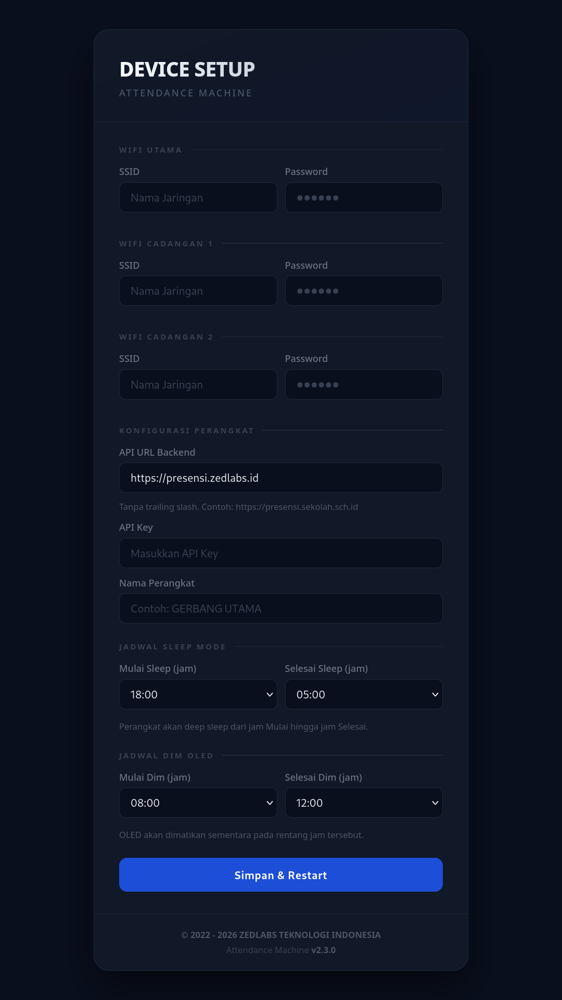

# Attendance Machine

**Attendance Machine** adalah solusi presensi cerdas berbasis _Internet of Things_ (IoT) yang dirancang untuk mengatasi tantangan infrastruktur jaringan yang tidak stabil. Dibangun di atas mikrokontroler ESP32-C3, sistem ini menerapkan arsitektur _Hybrid_ yang menggabungkan kemampuan pemrosesan daring (_online_) dan luring (_offline_) secara mulus.

---



---

## Requirements & Library
- ESP32 C3 Super Mini
- Module RFID Reader (MFRC522)
- Buzzer Pasif
- OLED 0.96" (Adafruit SSD1306 + Adafruit GFX Library)
- Module SD Card (SDFat — Legacy Memory Card Support)
- Module 4056 (charger baterai)
- Battery
- ArduinoJson
- Adafruit BusIO

## Environment Tools
| Item | Keterangan |
|---|---|
| Tools | Arduino IDE v2.3.6 |
| Board | ESP32 v3.3.11 |
| Schema Partition | Minimal SPIFFS (1.9MB APP with OTA/128KB SPIFFS) |
| Author | Yahya Zulfikri |
| Version | v2.3.2 |
| Backend | Laravel 11 + Filament 3 (PHP 8.4), di belakang Cloudflare proxy |

---

## Arsitektur Task / Concurrency
Firmware berjalan di atas FreeRTOS dengan 1 loop utama + 3 task paralel yang jalan terus-menerus setelah `setup()` selesai — bukan alur linear sekali jalan.

| Task | Fungsi | Prioritas | Stack | Core |
|---|---|---|---|---|
| `loop()` (main) | Baca kartu fisik RFID → masukkan ke queue, cek jadwal sleep tiap iterasi, trigger deep sleep | – | – | – |
| `taskRfid` | Proses antrian scan (debounce, validasi, kirim presensi) | 3 (tertinggi) | 8192 | Core 0 |
| `taskSync` | Reconnect WiFi, health check SD, OTA, sync data, telemetry, remote config, resync time | 2 | 8192 | Core 0 |
| `taskDisplay` | Update OLED, cek jadwal dim, cek factory reset | 1 (terendah) | 12288 | Core 0 |

**Sinkronisasi antar task:**
- `loop()` → `taskRfid`: via **FreeRTOS Queue** (`xRfidQueue`), pola *producer-consumer*.
- Resource bersama (SD, Display, Config) diproteksi pakai **Mutex/Semaphore** (`xSdMutex`, `xDisplayMutex`, `xConfigMutex`) agar tidak terjadi race condition antar task.

---

## Keamanan Data / Kredensial
Semua kredensial sensitif (SSID, password WiFi ×3, API Key, API URL) **tidak pernah disimpan plaintext** di NVS. Alur enkripsi:

1. **Key derivation** — Key AES-128 diturunkan dari MAC address unik device + salt tetap, di-hash dengan SHA-256 (`deriveAesKey`). Key berbeda tiap device dan tidak hardcoded di source code.
2. **Enkripsi** — Data dienkripsi dengan AES-128-CBC (`mbedtls_aes_crypt_cbc`) + random IV per record, sebelum disimpan lewat `prefs.putBytes()`.
3. **Dekripsi** — Saat dibutuhkan (boot / konek WiFi), data didekripsi kembali ke RAM saja, tidak pernah tersimpan plaintext di storage.

---

## Logika Bisnis

### 1. Provisioning
Saat boot, device mengecek flag `prov` di NVS. Jika belum diprovisioning (atau kredensial WiFi/API key kosong):
- Device masuk mode AP dengan SSID `ATTENDANCE MACHINE`, password unik per device (`ZEDLABS-XXXXXX`, di-derive dari MAC).
- DNS Server (captive portal) + Web Server (port 80) dijalankan bersamaan agar browser otomatis redirect ke halaman setup.
- User mengisi form (SSID ×3, API URL, API Key, nama device, jadwal sleep/dim) → data dienkripsi (lihat *Keamanan Data/Kredensial*) sebelum disimpan ke NVS.
- Timeout keseluruhan mode provisioning: 5 menit (`PROVISIONING_TIMEOUT_MS`) — kalau tidak diisi, device restart otomatis.

**Detail Web Server Provisioning:**
- `GET /` dan `onNotFound` → tampilkan form HTML.
- `POST /save` → validasi input:
  - SSID 1, API Key, API URL wajib diisi (response 400 kalau kosong).
  - API URL wajib berawalan `http://` atau `https://`, trailing slash dihapus otomatis, maksimum 79 karakter.
  - Nama device dipotong otomatis kalau melebihi `DEVICE_NAME_MAX_LEN` (31 karakter).
  - Jadwal sleep/dim divalidasi rentang 0–23, fallback ke default kalau invalid.
- Setelah tersimpan → flag `prov = true` di NVS → restart otomatis (delay 2 detik).

> ⚠️ **Catatan Operasional**: Nama device (`devname`) diisi bebas oleh user saat provisioning dan langsung dipakai sebagai `deviceId` di seluruh komunikasi device↔server. Nama yang mengandung **spasi** (mis. "ATTENDANDE MACHINE") **aman** untuk endpoint yang mengirim `device_id` lewat JSON body (heartbeat, sync, OTA check), tapi **berpotensi bermasalah** untuk endpoint yang mengirim `device_id` lewat query string URL — lihat *Remote Config* di bawah.

### 2. Init
- Inisialisasi watchdog per-task, OLED, buzzer, mutex (SD/Display/Config), queue RFID.
- Load kredensial terenkripsi dari NVS, generate `deviceId` dari MAC (atau pakai nama custom kalau diisi saat provisioning).
- Init SD card dengan retry (`reinitSDCard`), load cache RFID valid & admin list dari SD kalau tersedia.
- Kalau SD tidak tersedia → fallback ke NVS buffer sebagai penyimpanan sementara.

### 3. Connect to WiFi & Internet
- Coba konek ke 3 SSID tersimpan secara berurutan (`connectToWifi` loop).
- Kalau berhasil connect, `pingAPI()` dipanggil untuk validasi konektivitas ke backend — bukan sekadar cek status WiFi.
- Kalau gagal semua → device tetap lanjut jalan di **offline mode**, tidak blocking proses berikutnya.

**Parameter Radio WiFi (`connectToWifi` / `processReconnect`):**
- `WiFi.setTxPower(WIFI_POWER_19_5dBm)` — TX power maksimum, untuk memastikan jangkauan sinyal optimal.
- `WiFi.setSleep(WIFI_PS_MAX_MODEM)` — mode power-save agresif, radio banyak idle untuk hemat daya.
- `WiFi.persistent(true)` + `WiFi.setAutoReconnect(true)` — kredensial WiFi disimpan persisten di flash ESP32 dan auto-reconnect bawaan aktif berdampingan dengan state machine reconnect manual (`processReconnect`).

> ⚠️ **Catatan Troubleshooting**: Pada device dengan RSSI sangat kuat (mis. -30 dBm) namun tetap sering mengalami disconnect/reconnect berulang, penyebab yang lebih mungkin adalah **kombinasi daya (brownout saat TX burst) dan/atau mode power-save modem** — bukan kualitas sinyal. Lihat bagian *Known Issues* di bawah untuk detail diagnosis dan opsi mitigasi (`WiFi.setSleep(WIFI_PS_NONE)`, penyesuaian TX power, atau logging `WiFi.onEvent` untuk membaca disconnect reason code).

### 4. Sync Time
- NTP disinkron dari 3 server fallback: `pool.ntp.org`, `time.google.com`, `id.pool.ntp.org`.
- Waktu tersimpan di RTC memory (`lastValidTime`) + NVS sebagai backup lintas restart.
- Kalau NTP gagal, waktu diestimasi dari `bootTime + elapsed millis()`, dengan batas maksimum umur estimasi 12 jam (`MAX_TIME_ESTIMATE_AGE`) sebelum dianggap invalid.
- Timezone device di-hardcode via `GMT_OFFSET_SEC = 25200L` (UTC+7 / WIB), independen dari timezone Laravel (`config('app.timezone')`) — keduanya kebetulan sama-sama Asia/Jakarta pada deployment saat ini, namun tidak ada mekanisme sinkronisasi otomatis antara keduanya kalau salah satu berubah.

### 5. Health Check
- Berjalan periodik: cek SD card masih terbaca (`checkSDHealth`), cek sinyal WiFi lemah/kritis (RSSI threshold), jalankan reconnect state machine (`processReconnect`), kirim heartbeat/telemetry ke server tiap 60 detik (uptime, heap, RSSI, jumlah antrian, dll).

**Watchdog (WDT) Management:**
- WDT normal timeout: 90 detik (`WDT_NORMAL_TIMEOUT_MS`) — berlaku saat operasi biasa.
- Saat proses berat berjalan (sync data, OTA download) → WDT di-extend ke 180 detik (`extendWdtForSync`) agar tidak trigger reset di tengah proses panjang.
- Setelah proses berat selesai → WDT dikembalikan ke normal (`restoreWdtNormal`).
- Tiap task (`loop`, `taskRfid`, `taskSync`, `taskDisplay`) subscribe ke WDT masing-masing dan wajib reset (`esp_task_wdt_reset()`) di tiap iterasi — kalau satu task hang, device restart otomatis sebagai safety net.

### 6. Upload Data (Sisa Data Offline)
- Saat online kembali: sisa data di SD disinkron via `chunkedSync` (maksimum 5 file per siklus), sisa data di NVS buffer disinkron via `nvsSyncToServer`, dikirim bulk ke endpoint `/sync-bulk`.
- Proses dipecah per file agar tidak blocking terlalu lama, watchdog di-extend selama proses berjalan.

### 7. OTA Processing (Check & Update)
- Cek versi firmware ke server tiap interval tertentu (default 30 detik, bisa diubah via remote config).
- Kalau versi server lebih baru (semver compare) → download & flash via `Update` library, dengan validasi MD5.
- Reboot otomatis kalau update sukses.
- `device_id` dikirim lewat JSON body request (`/firmware/check`), sehingga **tidak terpengaruh** isu spasi di URL yang dialami endpoint `/config`.

### 8. Download Data RFID Terbaru — Protokol Sentinel `END`

> **PENTING — perubahan protokol terbaru.** Endpoint `/api/presensi/rfid-list` awalnya mengandalkan header HTTP `Content-Length` untuk menentukan kapan download selesai. Ini **tidak dapat diandalkan** pada deployment ini karena backend berada di belakang **Cloudflare** yang men-strip header `Content-Length` dan `Connection` dari response (walaupun Laravel sudah mengirimkannya secara eksplisit) — akibat perbedaan protokol HTTP/2 (Cloudflare↔origin) vs HTTP/1.1 (ESP32↔Cloudflare edge).

**Protokol final (Opsi B — Sentinel):**
- Server **wajib** mengirim baris literal `END\n` sebagai baris terakhir response, setelah seluruh baris RFID (dan setelah baris `ver:<versi>` di awal).
- Firmware (`downloadRfidDb()`) membaca stream baris-per-baris; begitu baris `END` terbaca, proses **langsung dianggap selesai dan sukses**, terlepas dari status koneksi (`http.connected()`) atau apakah masih ada stall timeout yang berjalan.
- Kalau `END` **tidak pernah diterima** (koneksi putus di tengah jalan / server crash), download dianggap gagal (`connectionDroppedEarly`), file sementara (`.tmp`) dihapus, versi RFID DB lokal **tidak** di-update — sehingga percobaan berikutnya (dipicu `checkAndUpdateRfidDb()`) akan otomatis mencoba ulang.
- Stall timeout (tidak ada data masuk sama sekali) di-set ke **120 detik** (`120000UL`) sebagai jaring pengaman terakhir kalau server hang total dan tidak mengirim `END` sama sekali.

**Format response `/api/presensi/rfid-list`:**
```
ver:<versi_integer>
<rfid_10_digit_1>
<rfid_10_digit_2>
...
END
```

- Baris `ver:` di awal dipakai untuk update versi RFID DB lokal (`nvsSetRfidDbVer`).
- Tiap baris RFID divalidasi harus **persis 10 digit numerik** — baris yang tidak valid (format salah, kepanjangan >31 karakter per baris) di-skip tanpa menggagalkan keseluruhan proses.
- File RFID DB disimpan dulu sebagai `.tmp`, baru di-rename menjadi `rfid_db.txt` setelah dipastikan lengkap (`END` diterima) — mencegah file RFID DB korup/setengah-jalan dipakai untuk validasi presensi.

### 9. Standby (Ready Mode)
- Layar OLED menampilkan status online/offline, jam, jumlah antrian pending, dan indikator sinyal WiFi (bar).
- Update layar hanya terjadi kalau ada perubahan state (`displayStateChanged`) — untuk hemat refresh & mencegah flicker.

### 10. Main Loop & Sleep Trigger
- `loop()` utama bertanggung jawab atas:
  1. Polling kartu RFID fisik (`PICC_IsNewCardPresent`) → masukkan event ke queue.
  2. Cek jam saat ini terhadap jadwal sleep di tiap iterasi.
  3. Kalau masuk jam sleep → set `sleepRequested = true`, tunggu semua task selesai kerja (± 5 detik), flush semua file SD, hitung durasi tidur, matikan OLED, lalu masuk **deep sleep** (`esp_deep_sleep_start()`).
- Kalau proses sync sedang berjalan (`syncState.inProgress`), sleep ditunda dulu sampai sync selesai — mencegah data hilang atau corrupt saat mendadak tidur.

> ⚠️ **Catatan Pengujian Remote Config**: Jendela **default** sleep adalah jam 18:00–05:00 (`SLEEP_START_HOUR_DEFAULT`/`SLEEP_END_HOUR_DEFAULT`). Kalau jendela dim OLED (via remote config) di-set berada **di dalam** rentang jam sleep default, efeknya **tidak akan pernah teramati** karena device sudah deep sleep (OLED mati total) sebelum jendela dim dimulai. Saat menguji perubahan remote config, gunakan jam pengujian di luar rentang sleep aktif device.

### 11. Tapping Process [Scan RFID]
- Task `taskRfid` menangani antrian scan dari `loop()` (pola *ISR-like* via queue).
- Debounce 150ms untuk UID kartu yang sama (`DEBOUNCE_TIME`).
- RFID admin memicu mode khusus (tampilkan status device + trigger sync manual), RFID biasa lanjut ke proses validasi & kirim presensi.

**Mode Admin (`handleAdminScan`):**
- Terpisah dari daftar RFID biasa — dicek lewat file khusus `/admin_rfid.txt` di SD card (maksimum 5 UID admin).
- Saat RFID admin di-tap: OLED menampilkan status ringkas device (jumlah antrian pending + jumlah scan hari ini), lalu **memicu sync manual** (`pendingCacheDirty = true`, reset state sync) tanpa menunggu siklus periodik `taskSync`.
- Tidak memproses presensi apa pun untuk UID admin — murni fungsi diagnostik/trigger di lapangan tanpa perlu akses ke dashboard.

### 12. Validate Data [RFID & Jadwal Presensi]
> Urutan proses: **Validate dulu, baru Save/Send.**
- RFID dicek ke cache lokal (`isRfidInCache`) **sebelum** proses simpan/kirim apa pun.
- Kalau RFID tidak terdaftar di cache → langsung ditolak ("RFID NONAKTIF") tanpa perlu request ke server sama sekali — hemat kuota & waktu.
- Validasi jadwal presensi (hari libur, dsb) dilakukan di sisi **server**, direspon lewat HTTP status code:
  - `400` → duplikat / sudah presensi
  - `403` → hari libur
  - `404` → RFID tidak aktif

### 13. Saving Data (Jalur SD Card Tersedia)
- Data disimpan ke file antrian CSV (`saveToQueue`), maksimum 25 record per file.
- Tiap record dilengkapi **CRC8 checksum** untuk deteksi korupsi saat file dibaca ulang.
- Duplikat dicek dari beberapa file terakhir dengan window waktu 30 menit (`MIN_REPEAT_INTERVAL`).

### 14. Send Data (Jalur Fallback — SD Tidak Tersedia/Corrupt/Leak)
- Kalau SD **tidak tersedia**, device mencoba kirim langsung ke server via HTTP (`kirimLangsung`) selama online.
- Kalau gagal atau memang offline → data disimpan ke **NVS buffer** (maksimum 40 record) sebagai fallback terakhir, sampai muncul status "BUFFER PENUH!" kalau kapasitas habis.

### 15. Bulk Send
- Data dikumpulkan jadi JSON array, dikirim sekali POST ke `/sync-bulk` **per file** (bukan per record) untuk efisiensi bandwidth.
- Response per-item dicek satu per satu — item yang gagal (`status: error`) dicatat ke `failed_log.csv` (maksimum 500 baris) sebagai audit trail, tanpa menghentikan proses sinkronisasi keseluruhan.

### 16. Remote Config (Server → Device Override)

- Device polling `GET /api/presensi/config?device_id=<deviceId>` tiap 10 menit (`REMOTE_CONFIG_INTERVAL`), dilewati kalau sinyal lemah (`isSignalWeak()`).
- Field yang bisa di-override dari server: `sleep_start`, `sleep_end`, `oled_dim_start`, `oled_dim_end`, `sync_interval_ms`, `ota_check_interval_ms`. Field yang dikosongkan (`NULL`) di admin panel → tidak dikirim server → device tetap pakai default lokal firmware.
- Perubahan disimpan persisten ke NVS (`persistRuntimeConfigToNvs`) sehingga bertahan lintas restart, tidak perlu di-fetch ulang tiap boot.

> ⚠️ **PENTING — URL Encoding.** `deviceId` disisipkan ke **query string** URL request config (`?device_id=<deviceId>`), berbeda dari endpoint lain (heartbeat, sync, OTA check) yang mengirim `device_id` lewat **JSON body**. Kalau nama device mengandung karakter selain alfanumerik/`-_.~` (terutama **spasi**), URL yang terbentuk menjadi tidak valid, menyebabkan request gagal terkirim dengan benar atau server tidak menerima `device_id` yang cocok — sehingga override config **tidak pernah ter-apply**, tanpa error yang terlihat di device (silent fail, karena `if (code != 200) return;` tanpa log).
>
> **Mitigasi**: firmware melakukan **URL-encoding** manual (`urlEncode()`) terhadap `deviceId` sebelum disisipkan ke query string endpoint `/config`. Fungsi ini meng-escape semua karakter di luar alfanumerik dan `-_.~` menjadi format `%XX`.

---

## Kondisi Fallback / Yang Perlu Diperhatikan

| Kondisi | Penanganan |
|---|---|
| **Signal Leak** | Threshold *Weak* (-85 dBm): OTA check, RFID DB check, telemetry, remote config di-skip. Threshold *Critical* (-90 dBm): NTP sync & `pingAPI` di-skip total, mencegah timeout panjang yang bisa memicu watchdog reset. |
| **Storage Leak** | `QUEUE_WARN_THRESHOLD` (48.000 file) jadi peringatan dini sebelum limit maksimum `MAX_QUEUE_FILES` (60.000). Saat limit tercapai, status `SAVE_QUEUE_FULL` dikembalikan dan device menampilkan "QUEUE PENUH!". |
| **Storage Corrupt** | Tiap record punya CRC8 checksum (`recordCrc8`). Record dengan CRC tidak cocok otomatis di-skip saat dibaca ulang. File CSV dengan 0 valid record otomatis dihapus. |
| **Storage Not Detected** | `checkSDHealth()` jalan tiap 30 detik. Kalau SD hilang, `sdCardAvailable = false`, cache RFID di-clear, device fallback ke jalur NVS buffer + kirim langsung via HTTP. Kalau SD terdeteksi kembali, otomatis reinit + reload cache tanpa restart. |
| **Server Down / API Tidak Dikenali** | HTTP code selain 200 masuk kategori "SERVER ERR", record fallback ke buffer untuk dikirim ulang. Retry dengan exponential backoff (`SYNC_RETRY_DELAY_MS * 2^attempt`), maksimum `MAX_SYNC_RETRIES` (2×). |
| **RFID DB Download Terputus** | Ditangani via sentinel `END` (lihat *Poin 8*). Koneksi putus/stall tanpa `END` diterima → file `.tmp` dihapus, versi lokal tidak berubah, retry otomatis di siklus `checkAndUpdateRfidDb()` berikutnya (tiap 60 detik, `RFID_DB_CHECK_INTERVAL`). |
| **Fallback Kegagalan/Warning (Umum)** | Semua kegagalan silent-fail dengan feedback OLED + buzzer (error tone 3× beep) — tidak pernah blocking tanpa info ke user. Item gagal sync dicatat ke `failed_log.csv`. |
| **No Power** | Data kritis (waktu terakhir, boot time, nomor file antrian aktif) disimpan di `RTC_DATA_ATTR`, bertahan lintas deep sleep/reboot ringan. Untuk power loss total, `lastValidTime` di-backup ke NVS. |
| **No WiFi** | Device tetap standby & bisa menerima tap kartu. Data diarahkan ke jalur offline (SD queue/NVS buffer). Reconnect dicoba tiap 60 detik dengan rotasi 3 SSID, timeout 20 detik per percobaan. |
| **No Internet** (WiFi connect tapi internet mati) | Dibedakan lewat `pingAPI()` — WiFi bisa connect ke router tapi `isOnline` tetap `false` kalau ping ke backend gagal. Mencegah device salah kira sudah online. |
| **No Waktu** (RTC invalid/NTP gagal total) | `getTimeWithFallback()` return `false` kalau NTP gagal DAN estimasi boot time sudah kadaluarsa (>12 jam) atau belum pernah sync sama sekali. Presensi ditolak dengan pesan "WAKTU INVALID". |
| **Task Hang / Blocking Terlalu Lama** | Ditangani via per-task Watchdog Timer — task yang tidak reset WDT dalam batas waktu akan memicu restart otomatis (lihat *Watchdog Management*). |
| **WiFi Disconnect Berulang meski RSSI Kuat** | Kemungkinan besar bukan masalah sinyal — kandidat utama: brownout akibat lonjakan arus TX (`WIFI_POWER_19_5dBm`) pada catu daya baterai/charger yang tidak sanggup suplai arus puncak, atau perilaku `WIFI_PS_MAX_MODEM` yang membuat AP menganggap klien idle. Lihat *Known Issues*. |
| **Remote Config Tidak Ter-apply** | Cek: (1) apakah `deviceId` mengandung karakter yang perlu di-encode di URL config, (2) apakah `device_id` yang tersimpan di panel admin **persis sama** dengan yang dipakai device, (3) apakah field yang diuji berada di luar jendela deep sleep device, (4) tunggu penuh interval polling 10 menit sebelum menyimpulkan gagal. |

---

## Fitur/Perilaku Mesin

| Fitur | Implementasi Kunci |
|---|---|
| **Provisioning** | Captive portal AP mode, form lengkap kredensial + jadwal, password AP unik per device dari MAC |
| **Dim Mode** | OLED mati otomatis di jam tertentu (`dimStartHour`–`dimEndHour`), dicek tiap 60 detik, bisa diubah via remote config |
| **Sleep Mode** | Deep sleep di luar jam operasional (`sleepStartHour`–`sleepEndHour`), hitung durasi tidur otomatis, flush semua file sebelum tidur |
| **Retensi Data Expired** | Record offline lebih tua dari `MAX_OFFLINE_AGE` (1 tahun) otomatis di-skip saat sync & dianggap tidak valid |
| **Animasi & Tampilan OLED** | Startup animation (slide-in text), progress bar (`showProgress`), signal bar indicator |
| **Suara Buzzer** | 4 pola beda: success (2×), error (3×), notify (1×), startup melody |
| **Debounce** | 150ms per UID sama (`DEBOUNCE_TIME`), mencegah scan ganda dari 1× tap fisik |
| **Reset Device** | Tahan tombol BOOT 5 detik → hapus semua NVS + file SD terkait → restart |
| **Update OTA** | Cek versi via semver compare, download dengan validasi MD5, auto-rollback kalau app tidak di-mark valid |
| **Heartbeat** | POST tiap 60 detik: uptime, heap, RSSI, jumlah pending, status SD |
| **Reconnect Internet** | State machine 5 state (IDLE → INIT → TRYING → SUCCESS/FAILED), rotasi SSID otomatis |
| **Resync Time** | Tiap 30 menit (`TIME_SYNC_INTERVAL`), non-blocking terhadap proses lain |
| **Remote Config** | Server bisa override jadwal sleep/dim & interval sync/OTA tanpa reflash, disimpan persisten ke NVS. `device_id` di-URL-encode untuk mencegah kegagalan silent akibat nama device dengan spasi. |
| **Remote Update OTA** | Sama seperti OTA processing, dipicu dari cek berkala bukan manual |
| **Save to NVS (Fallback)** | Struct `OfflineRecord` disimpan sebagai bytes di NVS, maksimum 40 record, auto-flush ke server begitu online |
| **Enkripsi Kredensial** | AES-128-CBC, key unik per device diturunkan dari MAC address |
| **Watchdog Extend/Restore** | Timeout WDT otomatis diperpanjang selama proses berat (sync/OTA), dikembalikan normal setelahnya |
| **Mode Admin RFID** | UID khusus (maks 5, dari `/admin_rfid.txt`) memicu tampilan status device + sync manual instan, tanpa mencatat presensi |
| **Download RFID DB Andal (Sentinel `END`)** | Protokol download tidak lagi bergantung pada `Content-Length`/status koneksi (tidak reliable di balik Cloudflare) — pakai baris penutup `END` sebagai penanda selesai yang eksplisit dan pasti |
| **Dashboard Admin (Filament)** | Panel `Mesin Presensi` menampilkan status live tiap device: online/offline, RSSI berwarna, status SD, antrean pending, **scan hari ini (real dari data presensi, bukan laporan device)**, free heap, uptime, IP terakhir — auto-refresh tiap 30 detik |

---

## Data Config yang Harus Disimpan Persisten Saat Provisioning
Agar tidak ditanyakan ulang setiap boot:
- Endpoint (API URL)
- API Key
- Kredensial WiFi (SSID + password, ×3 slot)

---

## Backend: Endpoint API (Laravel)

Semua route berada di bawah prefix `/api/presensi`, dilindungi middleware `api.secret` (header `X-API-KEY` wajib cocok dengan `config('services.api.secret')`).

| Method | Path | Fungsi | Kirim `device_id` via |
|---|---|---|---|
| POST | `/` atau `/rfid` | Presensi single (real-time, online) | JSON body |
| POST | `/validate` | Validasi RFID terdaftar/aktif | — |
| GET | `/status/{rfid}` | Status presensi hari ini per RFID | — |
| GET | `/jadwal` | Jadwal presensi hari ini | — |
| POST | `/sync-bulk` | Upload batch data offline (SD/NVS) | JSON body (per item) |
| GET | `/health` | Cek status DB & cache server | — |
| GET | `/ping` | Cek konektivitas dasar | — |
| GET | `/rfid-list` | Download daftar RFID valid (protokol sentinel `END`) | — |
| GET | `/rfid-list/version` | Cek versi RFID DB terbaru | — |
| POST | `/heartbeat` | Telemetry berkala (60 detik) | JSON body |
| GET | `/config` | **Ambil override remote config** | **Query string** ⚠️ |
| POST | `/firmware/check` | Cek versi firmware terbaru | JSON body |
| GET | `/firmware/download/{filename}` | Download file firmware OTA | — |

> Endpoint `/config` adalah **satu-satunya** yang mengirim `device_id` lewat query string URL, bukan JSON body — sehingga menjadi satu-satunya titik rawan terhadap karakter tidak valid (spasi, dll) di nama device.

## Backend: Dashboard Admin (`PresensiDeviceResource`)

Panel Filament `Mesin Presensi` (`app/Filament/Resources/PresensiDeviceResource.php`) menyediakan:
- **Monitoring real-time**: status online (berdasarkan `last_seen_at` < 10 menit), RSSI dengan indikator warna (hijau ≥ -70 dBm, kuning ≥ -85 dBm, merah di bawahnya), status SD card, antrean pending, RFID DB entries, free heap, uptime, IP terakhir — auto-refresh (`poll`) tiap 30 detik.
- **Kolom "Scan Hari Ini"**: dihitung **real-time langsung dari tabel `presensi_pegawais`/`presensi_siswas`** (filter `device_id` + `whereDate('tanggal', today)`), **bukan** dari angka yang dilaporkan device sendiri (`scan_today` via heartbeat) — karena angka dari device rentan drift kalau NTP device gagal sync atau device salah tanggal.
- **Override Remote Config**: form untuk mengisi/mengosongkan jadwal sleep, jadwal dim OLED, interval sync, dan interval cek OTA per device — dikonsumsi device lewat endpoint `/config` (lihat *Poin 16* di atas).
- **Filter cepat**: device online, antrean menumpuk, SD card bermasalah.

### Prasyarat Data — Kolom `device_id` di Tabel Presensi
Agar kolom "Scan Hari Ini" dan fitur analitik per-device lain berfungsi akurat, `PresensiService::prosesPresensi()` **wajib** menyimpan parameter `$deviceId` yang diterimanya ke kolom `device_id` pada tabel `presensi_pegawais`/`presensi_siswas` saat `create()` (presensi masuk). Kegagalan meneruskan `device_id` ke closure `DB::transaction()` (lupa menambahkannya ke daftar `use`) menyebabkan seluruh record presensi tersimpan dengan `device_id = NULL`, sehingga statistik per-device (termasuk dashboard admin) tidak akan pernah menunjukkan data yang benar meski presensi berhasil tersinkron.

---

## Known Issues & Troubleshooting

### WiFi disconnect berulang meski RSSI kuat (mis. -30 dBm)
Bukan masalah sinyal. Kandidat penyebab, urut dari yang paling mungkin:
1. **Brownout saat TX burst** — `WIFI_POWER_19_5dBm` (TX power maksimum) bisa menarik arus puncak 300–500mA sesaat; kalau suplai baterai/charger 4056 tidak sanggup, tegangan drop sesaat memicu reset radio.
2. **`WIFI_PS_MAX_MODEM`** — mode power-save agresif, dikenal bermasalah di sejumlah kombinasi ESP32-C3 + AP tertentu; radio bisa terlambat merespons beacon sehingga AP memutus koneksi dari sisinya sendiri.
3. **`setAutoReconnect(true)` tumpang tindih** dengan state machine reconnect manual (`processReconnect`), berpotensi saling mengganggu proses `WiFi.begin()`/`WiFi.disconnect()`.

Diagnosis paling akurat: pasang `WiFi.onEvent()` untuk log disconnect reason code, lalu uji satu variabel per waktu (`WiFi.setSleep(WIFI_PS_NONE)` dulu, baru TX power, baru auto-reconnect).

### Download RFID DB gagal terus ("UNDUH TERPUTUS")
Root cause: **Cloudflare men-strip header `Content-Length` dan `Connection`** dari response, sehingga firmware tidak bisa mengandalkan keduanya untuk mendeteksi selesai-tidaknya download. Solusi permanen: protokol sentinel `END` (lihat *Poin 8*) — pastikan endpoint `/rfid-list` di backend selalu mengirim baris `END` di akhir response.

### Remote config tidak ter-apply ke device
Urutan diagnosis:
1. Cek data tersimpan benar di database (`php artisan tinker`).
2. Cek `device_id` yang **benar-benar dipakai device** cocok persis dengan yang ada di panel admin (perhatikan spasi/karakter tersembunyi).
3. Cek apakah field yang diuji berada di luar jendela deep sleep device saat ini.
4. Pastikan sudah menunggu penuh 10 menit sejak boot/fetch terakhir.
5. Kalau semua di atas sudah benar tapi tetap gagal, kemungkinan besar isu **URL encoding** — pastikan firmware sudah memakai `urlEncode()` sebelum menyisipkan `deviceId` ke query string `/config`.

### Statistik "Scan Hari Ini" di dashboard selalu 0 padahal presensi sukses
Cek kolom `device_id` di record presensi terkait (`php artisan tinker`) — kalau `null`, kemungkinan besar `PresensiService::prosesPresensi()` menerima parameter `$deviceId` tapi tidak meneruskannya ke `create()`/`update()` (lupa ditambahkan ke `use` closure `DB::transaction()` dan ke array data yang disimpan).

---

## Referensi
- **Non-blocking state machine (tick-based FSM)** — pola untuk `ReconnectState` & `SyncState`, dieksekusi per-tick tanpa `delay()` blocking.
- **AES-128-CBC + SHA-256 key derivation (mbedtls)** — untuk enkripsi kredensial sebelum disimpan ke NVS.
- **FreeRTOS Task + Queue + Mutex** — arsitektur dasar concurrency multi-task pada firmware ini.
- **Sentinel-based stream termination** — pola pengganti `Content-Length`/connection-close detection untuk transfer data di balik reverse proxy (Cloudflare) yang tidak meneruskan header transport-level secara konsisten.
